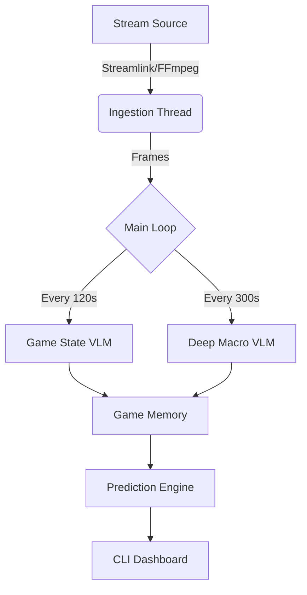

# Chronos v3: Autonomous League of Legends Prediction Engine 🔮

**Chronos v3** is an advanced AI system that watches live League of Legends esports broadcasts (LPL, LCK, LEC, LCS) and provides real-time strategic analysis and win probability predictions. It leverages **Google's Gemini 1.5 Pro/Flash** multimodal models combined with traditional Computer Vision techniques to "see" the game state, understand macro-level flow, and predict outcomes with high accuracy.

## 🚀 Key Features

- **Live Stream Ingestion**: Connects directly to Twitch, YouTube, and Huya streams via `streamlink` and `ffmpeg` (1080p60 support).
- **Deep Macro Analysis 🔭**: uses Gemini 1.5 Pro's 1M+ token context window to analyze multi-frame sequences (video-like) to detect momentum shifts, vision control, and cross-map plays.
- **Strict Budget Optimization 📉**: Intelligent model rotation and cadence-based triggering to operate indefinitely within strict API rate limits (20 Requests Per Day per model for free tier usage).
- **Triple-Thread Architecture**: Decoupled ingestion, main loop, and VLM threads ensure zero frame drops and non-blocking analysis.
- **Narrative Intelligence 🧠**: Tracks "Fog of War" (MIA statuses), validates game state consistency (self-correction), and builds a narrative history of the match.
- **Real-Time Dashboard**: Outputs a clean CLI dashboard with gold differences, objective timers, win probability, and detailed strategic reasoning.

## 🛠️ Tech Stack

- **Core**: Python 3.10+, AsyncIO
- **AI/VLM**: Google Gemini API (`google-generativeai`)
- **Vision**: OpenCV (`cv2`), Pillow, NumPy
- **Stream**: Streamlink, FFmpeg, yt-dlp
- **Data**: Riot DataDragon (Static assets)

## 📦 Installation

1.  **Clone the repository**:
    ```bash
    git clone https://github.com/bluerememberedearth/chronos.git
    cd chronos
    ```

2.  **Set up Virtual Environment**:
    ```bash
    python3 -m venv .venv
    source .venv/bin/activate
    ```

3.  **Install Dependencies**:
    ```bash
    pip install -r requirements.txt
    ```
    *Note: Requires `ffmpeg` installed on your system path.*

4.  **Configure Environment**:
    Create a `.env` file in the root directory:
    ```bash
    GEMINI_API_KEY=your_api_key_here
    ```

## 🎮 Usage

### Live Prediction (Cadence Mode)
The primary script for live games. It uses a fixed cadence (120s standard, 300s deep dive) to manage API budgets perfectly.

```bash
# Standard Usage
python scripts/predict_live.py "https://www.twitch.tv/lec" \
  --blue "Sion,Sylas,Yone,Corki,Bard" \
  --red "DrMundo,Pantheon,Azir,Varus,Alistar"
```

**Parameters:**
- `URL`: Stream URL (Twitch/YouTube/Huya).
- `--blue`, `--red`: Comma-separated list of 5 champions (Top, Jungle, Mid, ADC, Support).
- `--budget`: Optional max VLM calls (default 15).

### Other Scripts
- **`scripts/test_fog_of_war.py`**: Validates the objective permanence logic.
- **`scripts/inspect_huya.py`**: Debug tool for Huya stream parsing.
- **`scripts/debug_stream.py`**: Tests raw stream ingestion without VLM calls.

## 🏗️ Architecture



## 📝 Roadmap

- [x] **Cadence-Based Triggers**: predictable API usage.
- [x] **Multi-Model Rotation**: 120+ daily calls via pool rotation.
- [ ] **Auto-Draft Detection**: Remove manual champion input.
- [ ] **Web UI**: React/Next.js dashboard for visualization.

## License

MIT License.
